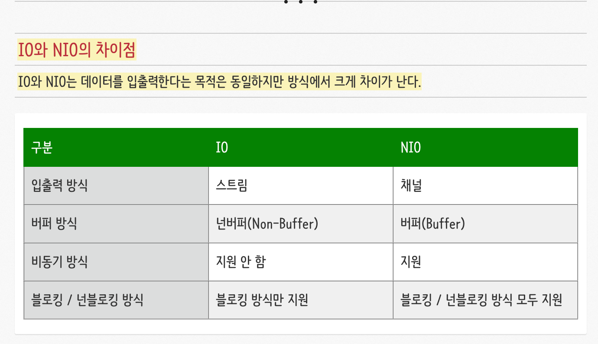
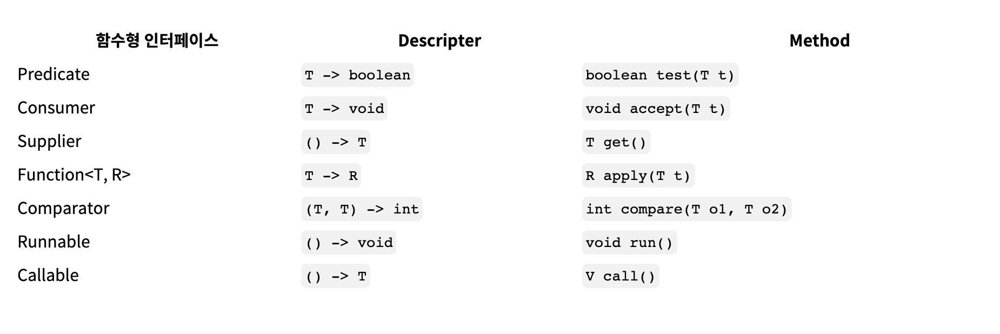
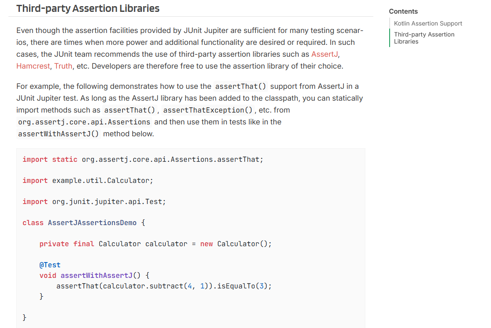

# be-was-2025
코드스쿼드 백엔드 교육용 WAS 2025 개정판


# 계획

## 1주차 초기 계획
현 상황 기준으로 각 단계별 문제는 어떻게 진행할지, debugging challenge 진행 여부 등을 고민해봤습니다.

- 1일차 : 기초 세팅 및 1주차 초기 계획 수립
- 2일차 : mac이랑 친해지기 & 1단계 구현 및 학습 완료 ⇒ 공유까지 진행되면 좋을 것 같습니다.
- 3일차 : 2단계, 3단계 구현 및 학습 완료
- 4일차 : 학습 내용을 토대로 한 가지 주제 정해서 깊게 공부해보고 공유
- 5일차 : 4일차 내용 추가 진행 및 개선점 파악해보기

debug 챌린지는 java 사용 경험이 있는 입소자는 필수가 아니라고 하셨기 때문에 일단 보류해두고, 진행하겠습니다.

## 2주차 초기 계획

- 1일차 : error 처리 및 코드 로직 재구조화. 4단계 개발 완료
- 2일차 : 5단계 개발 완료 및 관련 학습 진행
- 3일차 : 학습 과정에서 알게 된 부분 딥다이브 및 코드 리팩토링/수정
- 4일차 : 6단계 개발 완료 및 관련 학습 진행
- 5일차 : 학습 과정에서 알게 된 부분 딥다이브 및 코드 리팩토링/수정


# 정리

## gradle 내부 구조

https://m.blog.naver.com/sqlpro/222666588911

```bash
.
├── build.gradle
├── gradle
│   └── wrapper
│       ├── gradle-wrapper.jar
│       └── gradle-wrapper.properties
├── gradlew
├── gradlew.bat
├── settings.gradle
└── src
    ├── main
    │   ├── java
    │   │   └── App.java
    │   └── resources
    └── test
        ├── java
        │   └── AppTest.java
        └── resources
```

- build.gradle
  Gradle 기본 빌드 설정용 스크립트 파일이다. 프로젝트의 빌드 처리 및 의존성에 대한 설정이 작성되어 있다.
- gradle 디렉토리
  Gradle 환경을 래핑한 wrapper 파일들이 저장된다.
- gradle/wrapper/gradle-wrapper.properties
  프로젝트를 빌드에 사용할 gradle 버전을 포함하여, gradle 실행에 필요한 설정 정보가 기록된다. 다른 버전의 gradle을 사용하여 프로젝트를 빌드하고 싶다면 이 파일의 내용을 수정하면 된다.
- gradlew
  macOS 및 Linux에서 실행하기 위한 gradle 구현체이다.
- gradlew.bat
  Windows용 gradle 구현체이다.

- settings.gradle
  프로젝트 설정 정보를 담은 파일이다. 프로젝트 명 및 서브 프로젝트 정보 등이 모두 기록된다.
- src 디렉토리
  Gradle 프로젝트에서 사용하는 소스 코드나 리소스, 테스트 코드 등의 파일이 저장된다. main과 test라는 2개의 폴더가 포함된다.
- src/main 디렉토리
  애플리케이션 구현에 필요한 소스 코드를 저장하는 디렉토리이다. 언어별로 하위 디렉토리가 구분되며, 기본적으로 App.java 파일이 포함된다.
- src/test 디렉토리
  애플리케이션 테스트에 필요한 단위 테스트 파일을 모아두는 디렉토리이다. 여기에 작성된 내용은 빌드시에 포함되지 않지만, CI/CD 파이프라인에서는 중요한 역할을 한다.

gradle : 여러 모듈로 구성되는 java 프로젝트를 구조화하고, 테스트/빌드/실행 과정을 쉽게 진행할 수 있도록 도와주는 task 관리와 종속 라이브러리 관리 등을 단순화 하는 빌드 툴

jar

java 프로젝트를 빌드함으로써 생성되는 산출물. jar 파일에는 실행 가능한 jar파일이 있고, library 형태의 실행 불가한 jar 파일이 있습니다.

### `./gradlew run` vs `java -jar app.jar`

각각의 의미는

- Gradle 설정에 정의된 실행 task를 통해
  컴파일, classpath 구성, 의존성 로딩 등
  **실행에 필요한 과정을 포함하여 JVM을 기동한다.**
- 이미 빌드되어서 산출된, 실행 가능한 jar 파일을

  **JVM이 직접 실행한다.**


<aside>
💡

Visual studio에서 실행하는 C++ 프로젝트로 예를 든다면,

`./gradlew run` 는 IDE에서 debug 실행하는 것

`java -jar app.jar` 는 빌드된 exe파일을 눌러 직접 실행하는 것과 유사합니다.

</aside>

## plugin 정리

https://kotlinworld.com/323

### Plugin이란?

Gradle Task의 집합

구글이나 IDE 개발사인 JetBrains에서 미리 만들은 다음 Plugin 형태로 묶어놓으면,

저희는 해당 plugin을 가져다 사용할 수 있습니다.

```
plugins {
    id 'com.android.application'
    id 'org.jetbrains.kotlin.android'
}
```

### gradle task란?

https://developerpearl.tistory.com/101

task : 빌드로 수행되는 하나의 독립적인 유닛

**Task의 분류**

1. Actionable  Task : 액션이 있는 task로 **compileJava**와 같은 task

2. Lifecycle task : 액션이 없는 task로 **assemble, build**와 같은 task

dependsOn과 같은 구조를 통해 다른 task에 의존적인 task도 생성할 수 있습니다.


## nio vs io

https://dev-coco.tistory.com/42



- 스트림 vs 채널

  스트림은 단방향, 채널은 양방향입니다. 따라서 IO는 입력 스트림, 출력 스트림을 따로 생성해야 하지만, NIO의 경우는 하나의 채널만으로도 입출력이 가능합니다.

- non-buffer vs buffer

  IO의 경우는 따로 버퍼에 저장하지 않기 때문에 순서대로 들어오는 데이터를 따로 저장해두지 않으면 이전 데이터를 다시 확인할 수가 없습니다. NIO는 입력이 들어오는대로 버퍼에 저장하기 때문에 원하는 위치의 데이터를 읽을 수 있습니다.

  그러나, 버퍼 크기 문제나 속도 등의 문제로 대용량 데이터 읽기가 필요한 경우에는 IO가 더 강점을 보입니다.

- 비동기 지원 유무{블로킹 vs 넌 블로킹}

  IO는 스트림이 IO작업을 하고 있다면 block됩니다. NIO는 여러 채널을 열어두고 준비가 된 채널에서 데이터를 가져오는 방식이기 때문에 비동기가 지원됩니다.

  IO는 read/write 함수 호출 시 데이터가 입력될 때/출력될 때까지 block됩니다. interrupt 발생 시에는 빠져나올 수 있습니다. NIO 같은 경우는 블로킹 사용 시 IO와 같이 인터럽트 발생 시 빠져나오게 할 수도 있고, 비동기 방식으로 넌 블로킹도 지원합니다.

  ** 멀티플렉서(multiplexor)인 셀렉터(Selector)


## 자바 스레드 모델

https://tyan-8.tistory.com/30

### release 8에서의 Thread 설명

https://docs.oracle.com/javase/8/docs/api/java/lang/Thread.html

스레드는 프로그램 내에서 실행되는 일련의 동작입니다. 자바 가상 머신(JVM)은 애플리케이션이 여러 개의 실행 스레드를 동시에 실행할 수 있도록 지원합니다.
모든 스레드는 우선순위를 가지고 있습니다. 우선순위가 높은 스레드가 낮은 스레드보다 우선적으로 실행됩니다. 각 스레드는 데몬으로 표시될 수도 있고 그렇지 않을 수도 있습니다. 어떤 스레드에서 실행되는 코드가 새로운 Thread객체를 생성할 때, 새 스레드의 초기 우선순위는 객체를 생성하는 스레드의 우선순위와 동일하게 설정되며, 객체를 생성하는 스레드가 데몬 스레드인 경우에만 새 스레드도 데몬 스레드가 됩니다.

자바 가상 머신이 시작될 때, 일반적으로 데몬 스레드가 아닌 단일 스레드가 실행됩니다(이 스레드는 일반적으로 main지정된 클래스의 메서드를 호출합니다). 자바 가상 머신은 다음 중 하나가 발생할 때까지 스레드를 계속 실행합니다.

- exit클래스의 메서드[Runtime]가 호출되었고 보안 관리자가 종료 작업을 허용했습니다.
- 데몬 스레드가 아닌 모든 스레드는 메서드[run] 호출에서 반환되었거나 메서드 run를 넘어 전파되는 예외를 발생시켜 종료되었습니다 .

새로운 실행 스레드를 생성하는 방법은 두 가지가 있습니다. 하나는 클래스를 상속받는 하위 클래스를 선언하는 것입니다 . 이 하위 클래스는 클래스의 메서드를 Thread오버라이드해야 합니다 . 그런 다음 하위 클래스의 인스턴스를 할당하고 시작할 수 있습니다.

각 스레드에는 식별을 위한 고유한 이름이 부여됩니다. 여러 스레드가 동일한 이름을 가질 수 있습니다. 스레드 생성 시 이름을 지정하지 않으면 새로운 이름이 자동 생성됩니다.

별도로 명시되지 않는 한, 이 클래스의 생성자나 메서드에 null 인자를 전달하면 NullPointerException 예외가 발생합니다.

https://beststar-1.tistory.com/20

현 버전과의 가장 큰 차이 ⇒ version 21부터 가상 스레드 생성

### Thread와 Virtual thread 의 차이

https://docs.oracle.com/en/java/javase/21/core/virtual-threads.html#GUID-DC4306FC-D6C1-4BCC-AECE-48C32C1A8DAA

`java.lang` 에서 제공하던 Thread 모듈은 java21 SE 업데이트 과정에서 가상 스레드가 추가되었습니다.

기존 스레드를 플랫폼 스레드, 그리고 추가된 virtual thread를 가상 스레드라고 합니다.

- JAVA SE : C언어의 표준인 C9, C11처럼, JAVA의 표준 문법을 의미 (JAVA SE 11, 12 등)
- JAVA EE : JAVA SE에 엔터프라이즈용 여러 기능(라이브러리 등)을 포함한 확장 버전
- JRE : Java Runtime Environment (JAVA 버전에 따른 기본 라이브러리 포함)
- JVM : Java Virtual Machine (자바 코드를 해석해서 프로그램을 실행해주는 가상 머신)

플랫폼 스레드와 가상 스레드

플랫폼 스레드는 운영체제(OS) 스레드를 감싸는 얇은 래퍼로 구현됩니다. 플랫폼 스레드는 하위 OS 스레드에서 Java 코드를 실행하며, 플랫폼 스레드는 자신의 수명 동안 OS 스레드를 점유합니다. 따라서 사용 가능한 플랫폼 스레드의 수는 OS 스레드의 수로 제한됩니다.

플랫폼 스레드는 일반적으로 운영 체제에서 관리하는 대규모 스레드 스택 및 기타 리소스를 가지고 있습니다. 모든 유형의 작업을 실행하는 데 적합하지만 리소스 사용량이 제한될 수 있습니다.

즉, os 스레드를 어플리케이션 레벨에서 제어할 수 있도록 구현된 wrapper 모델이라고 할 수 있습니다.

가상 스레드는 기존 플랫폼 스레드에 마운트하는 방식으로 사용되는 스레드입니다. IO 작업과 같이 block이 발생하는 경우, 플랫폼 스레드에 마운트 되어있던 스레드를 다른 대기하고 있는 가상 스레드로 재 마운트하여 진행함으로써 블로킹이 없는 것처럼 동작할 수 있습니다.

그러나 이러한 가상 스레드의 사용은 공식 문서에서도 명시하듯이, 작업 자체를 더 빠르게 수행하기 위한 목적이 아니라, 블로킹이 빈번한 IO 중심 작업에서 높은 확장성을 확보하기 위한 방식입니다.

성능(performance)
→ 한 작업을 얼마나 빨리 처리하느냐

확장성(scalability)
→ 동시에 처리 가능한 작업 수를 얼마나 늘릴 수 있느냐

### 가상 스레드에서의 pinning 문제

가상스레드의 장점 : 가상 스레드에서 block이 일어나도, 다른 가상 스레드를 마운트하여 실행함으로써 OS 스레드의 block을 줄이고 JVM 내에서 여러 스레드를 동시에 처리할 수 있는 것.

pinning은 이러한 가상 스레드에서 block이 일어났음에도 아래 경우에 해당하여 다른 가상 스레드를 carrying 스레드에 마운트 할 수 없는 상태를 이릅니다.

- synchronized 블록 안에서 블로킹
  - 락 무결성이 깨질 수 있어서, unmount를 할 수 없습니다.
- 네이티브(native) 블로킹 호출
  - 언제 응답이 돌아올지 알 수가 없어서, unmount를 할 수 없습니다.
- 오래된 blocking I/O (일부)

이러한 경우는 가상 스레드의 장점을 없앨 뿐만 아니라, 프로젝트에 할당 가능한 OS 자원(스레드)에 비해 훨씬 많이 생성할 수 있는 가상 스레드가 block된 채로 플랫폼 스레드까지 block하게 되어 성능적인 문제를 초래할 수 있습니다.

이 때문에, 공식 문서에서도 가급적 잦은 synchronized 사용을 지양하길 추천하며 아래와 같은 예시를 함께 명시해 두었습니다.

```
synchronized(lockObj) {
    frequentIO();
}
```

다음 내용으로 대체할 수 있습니다.

```
lock.lock();
try {
    frequentIO();
} finally {
    lock.unlock();
}

```

## concurrent 패키지

https://dmansp.tistory.com/69

https://github.com/shinminkyoung1/be-was/wiki/2025-12-29#%EB%8B%A8%EC%9C%84-%ED%85%8C%EC%8A%A4%ED%8A%B8unit-test%EB%A5%BC-%ED%86%B5%ED%95%9C-%EA%B2%80%EC%A6%9D

동기화에 필요한 다양한 클래스를 제공하는 패키지입니다.

- Executors : 스레드 풀 생성, 스레드 재사용, task등록과 실행등을 간편하게 처리할 수 있습니다.
- Atomic : 동기화 되어 있는 변수를 제공한다. Automic_ 접두어가 붙는 클래스입니다.
- Locks : 상호배제를 사용할 수 있는 클래스를 제공합니다.
- Queues : 컬렉션 프레임워크에서 제공하는 선입선출(FIFO) 방식의 데이터 처리 흐름이며 컨커런트 api에서 제공하는 큐는 thread-safe 합니다.
- Synchronizers : 동기화 관련된 5가지 유틸리티를 제공합니다. 동시에 실행할 수 있는 스레드의 크기를 제한하는 기능을 제공하며 Semaphore 클래스를 이용하면 쉽게 구현할 수 있습니다.

최대 생성 스레드 수를 지정하여 스레드 풀을 관리하고 사용 완료한 스레드를 이후에 재사용하는 등 오버헤드를 줄이는 방식 사용을 돕습니다.

## 함수형 인터페이스

클래스가 아닌 인터페이스이기 때문에 다른 인터페이스들을 상속하여 확장성에 이점을 가집니다.



### Runnable

https://www.daleseo.com/java-thread-runnable/

Runnable 인터페이스는 반환 가능 타입이 void 로 실행하는데 중점을 둔 경우에 자주 사용되는 모듈입니다.

반환값 없이 run 함수만 구현해서 사용할 수 인터페이스입니다.

초기에 인자 없이 구현하는 것만 생각하다가 사용했습니다. ⇒ 이 탓에, 인자도 반환 값도 외부에서 처리하지 못하는 이슈가 생겨서 Function 인터페이스를 사용해야겠다고 생각했습니다.

### Function<>

인자를 하나 입력할 수 있지만, req 데이터로부터 모든 필요 값이 나올 것이기 때문에 route 하는데 문제가 없다고 판단했습니다.

⇒ 현재는 구현 과정 중에 문제가 없다면 해당 구조를 이어갈 생각입니다.

## 테스트의 정의

### 종류

**기준 - 코드의 범위**

- 단위 테스트 (Unit Test)

가장 작은 코드 조각(메서드, 클래스)이 예상대로 작동하는지 확인합니다. 개발 초기 단계에서 버그를 빠르게 잡는 데 유용하며, JUnit5와 같은 도구를 사용합니다.

- 통합 테스트 (Integration Test)

여러 단위 또는 모듈이 서로 연동될 때 문제없이 동작하는지 검증합니다.

- 시스템 테스트 (System Test)

전체 애플리케이션이 통합된 상태로 요구사항을 만족하는지 확인하는 테스트입니다.

- 인수 테스트 (Acceptance Test)

최종 사용자의 관점에서 소프트웨어가 비즈니스 요구사항을 충족하는지 확인하는 단계로, 종종 시스템 테스트와 함께 진행됩니다.

**기준 - 목적**

- 기능 테스트 (Functional Test / E2E)

사용자의 시나리오에 따라 애플리케이션의 전체 흐름과 기능이 올바르게 동작하는지 검증합니다. 엔드투엔드(End-to-End) 테스트라고도 불립니다.

- 성능 테스트 (Performance Test)

애플리케이션의 속도, 응답성, 안정성 등을 측정합니다.

- 회귀 테스트 (Regression Test)

코드 변경 후 기존 기능에 문제가 발생하지 않았는지 확인하는 재현 테스트입니다.

### 필요성

https://www.ibm.com/kr-ko/think/topics/software-testing

소프트웨어 테스트 : 소프트웨어 제품 또는 애플리케이션이 특정 요구 사항에 따라 정확하고 안전하며 효율적으로 작동하는지 평가하고 검증하는 프로세스

초기 소프트웨어 테스트는 제품이 시장에 출시되기 전에 문제를 식별합니다. 개발 팀이 테스트 피드백을 빨리 받을수록 다음과 같은 심각한 문제를 더 신속하게 해결할 수 있습니다.

⇒ 기업은 효과적인 테스트 기법과 QA 프로세스를 구현하여 개발 및 지원 비용 등을 절약할 수 있습니다.

- 아키텍처 결함
- 잘못된 설계 결정
- 유효하지 않거나 잘못된 기능
- 보안 취약점
- 확장성 문제

### JUnit과 AssertJ

**JUnit**

https://docs.junit.org/6.0.1/overview.html

https://docs.gradle.org/current/userguide/java_testing.html#using_junit5

JUnit은 자바 프로그래밍 언어용 유닛 테스트 프레임워크.


```
JUnit은 세 개의 하위 프로젝트에서 파생된 여러 모듈로 구성되어 있습니다.

JUnit 6.0.1 = JUnit 플랫폼 + JUnit 주피터 + JUnit 빈티지

JUnit 플랫폼은 JVM에서 테스트 프레임워크를 실행하기 위한 기반을 제공합니다 . 또한 TestEngine플랫폼에서 실행되는 테스트 프레임워크 개발을 위한 API를 정의합니다. 더 나아가, 명령줄에서 플랫폼을 실행할 수 있는 콘솔 런처 와 플랫폼에서 하나 이상의 테스트 엔진을 사용하여 사용자 지정 테스트 스위트를 실행할 수 있는 JUnit 플랫폼 스위트 엔진을 제공합니다 .

JUnit Jupiter 는 JUnit 테스트 및 확장 기능을 작성하기 위한 프로그래밍 모델 과 확장 모델 의 조합입니다 . Jupiter 하위 프로젝트는 TestEngine플랫폼에서 Jupiter 기반 테스트를 실행하기 위한 도구를 제공합니다.

JUnit Vintage는 JUnit 3 및 JUnit 4 기반 테스트를 플랫폼에서 실행할 수 있도록 지원합니다 TestEngine. 이를 위해서는 클래스 경로 또는 모듈 경로에 JUnit 4.12 이상 버전이 설치되어 있어야 합니다. 단, JUnit Vintage 엔진은 더 이상 사용되지 않으므로 JUnit Jupiter 또는 JUnit 플랫폼을 기본적으로 지원하는 다른 테스트 프레임워크로 테스트를 마이그레이션하는 동안에만 임시로 사용해야 합니다.
```

⇒ 테스트 엔진을 제공해주는 단위 테스트 프레임워크.

### AssertJ

https://xxeol.tistory.com/12

JUnit에서 공식적으로 추천하는 서드파티 라이브러리. 가독성, 에러 확인, 다양한 검증 method 등 테스트 코드 작성에 도움을 줍니다.



- 가독성

    ```java
    // 1. Plain JUnit
    assertEquals(a, b);
    
    // 2. AssertJ + JUnit
    assertThat(a).isEqualTo(b);
    ```

  `테스트한 값`과 `비교하는 정답 값`이 어떤 값인지 파악 가능.

    ```java
    // 1. Plain JUnit
    assertThat("[TITLE] Hello, My Name is ash")
            .isNotEmpty()
            .contains("[TITLE]")
            .containsOnlyOnce("ash")
            .doesNotStartWith("[ERROR]");
            
    // 2. AssertJ + JUnit
    assertThat(score)
            .isPositive()
            .isGreaterThan(60)
            .isLessThanOrEqualTo(75);
    ```

  메소드 체이닝도 제공함으로써, 가독성 향

- 실패 원인 체크

    ```java
    // 1. Plain JUnit 결과
    expected: <true> but was: <false>
    Expected :true
    Actual   :false
    
    // 2. AssertJ + JUnit 결과
    java.lang.AssertionError:
    Expecting actual:
      "ash"
    to contain:
      "o"
    ```

  실제 출력 값을 비교해볼 수 있음.

- 다양한 검증 메소드 제공

    ```java
    //  1. Plain JUnit
    assertTrue(winners.containsAll(List.of("애쉬", "스플릿")) && winners.size() == 2);
    assertArrayEquals(winners.toArray(), new String[]{"애쉬", "스플릿"});
    assertTrue(winners.containsAll(List.of("애쉬", "스플릿")));
    
    // 2. AssertJ + JUnit
    assertThat(winners).containsExactlyInAnyOrder("애쉬", "스플릿");
    assertThat(winners).containsExactly("애쉬", "스플릿");
    assertThat(winners).contains("애쉬", "스플릿");
    ```
  
## HTTP 응답 구조

HTTP 요청과 응답의 구조는 서로 닮았으며, 그 구조는 다음과 같습니다.

1. 시작 줄('start-line')에는 실행되어야 할 요청, 또은 요청 수행에 대한 성공 또는 실패가 기록되어 있습니다. 이 줄은 항상 한 줄로 끝납니다.
2. 옵션으로 'HTTP 헤더' 세트가 들어갑니다. 여기에는 요청에 대한 설명, 혹은 메시지 본문에 대한 설명이 들어갑니다.
3. 요청에 대한 모든 메타 정보가 전송되었음을 알리는 빈 줄('blank line')이 삽입됩니다.
4. 요청과 관련된 내용(HTML 폼 콘텐츠 등)이 옵션으로 들어가거나, 응답과 관련된 문서가 들어갑니다. 본문의 존재 유무 및 크기는 첫 줄과 HTTP 헤더에 명시됩니다.

HTTP 메시지의 시작 줄과 HTTP 헤더를 묶어서 '요청 헤드(head)' 라고 부르며, 이와 반대로 HTTP 메시지의 페이로드는 '본문(body)'이라고 합니다.

### HTTP 응답

- 상태 줄

  HTTP 응답의 시작 줄은 '상태 줄(status line)'' 이라고 불리며, 다음과 같은 정보를 가지고 있습니다.

  보통 HTTP/1.1인 프로토콜 버전입니다.
요청의 성공 여부를 나타내는 '상태 코드'입니다. 일반적인 상태 코드는 200, 404 혹은 302입니다.
사람이 HTTP 메시지를 이해할 때 도움이 되는 상태 코드에 대한 짧고, 순전히 정보 제공 목적의 '상태 텍스트'
상태 줄은 일반적으로 HTTP/1.1 404 Not Found. 같이 표현됩니다.

- 헤더

  응답에 들어가는 HTTP 헤더는 다른 헤더와 동일한 구조를 따릅니다. 대소문자를 구분하지 않는 문자열 다음에 콜론(':')이 오며, 그 뒤에 오는 값은 구조가 헤더에 따라 달라집니다. 헤더는 값을 포함해 전체를 한 줄로 표시합니다.
다양한 종류의 응답 헤더가 있는데, 이들은 다음과 같이 몇몇 그룹으로 나눌 수 있습니다.

  Via와 같은 General 헤더는 메시지 전체에 적용됩니다.
Vary와 Accept-Ranges와 같은 Response 헤더는 상태 줄에 포함되지 않은 서버에 대한 추가 정보를 제공합니다.
메시지 데이터의 원래 형식과 적용된 인코딩을 설명하는 Content-Type와 같은 Representation 헤더(메시지에 본문이 있는 경우에만 존재합니다).